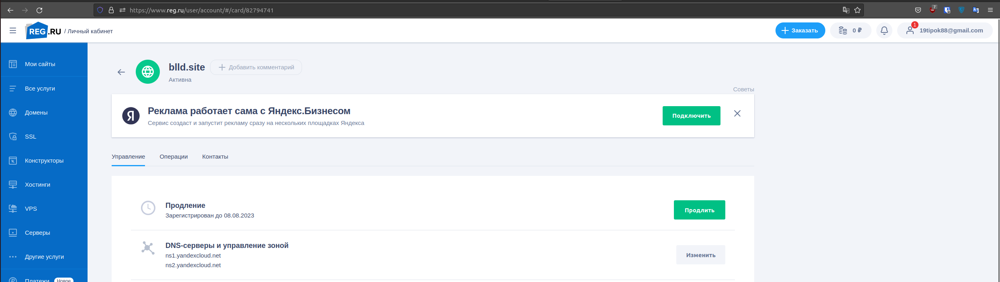
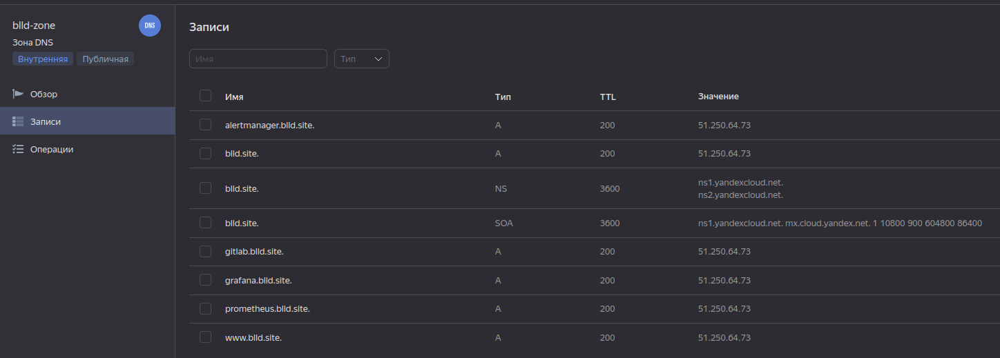
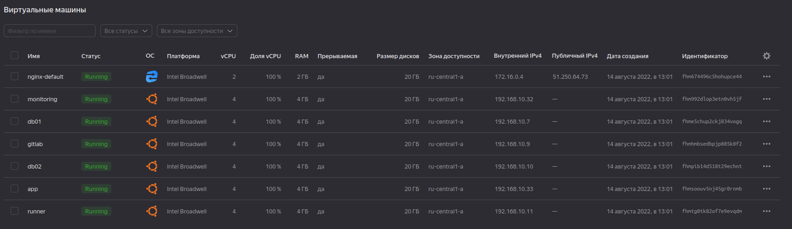
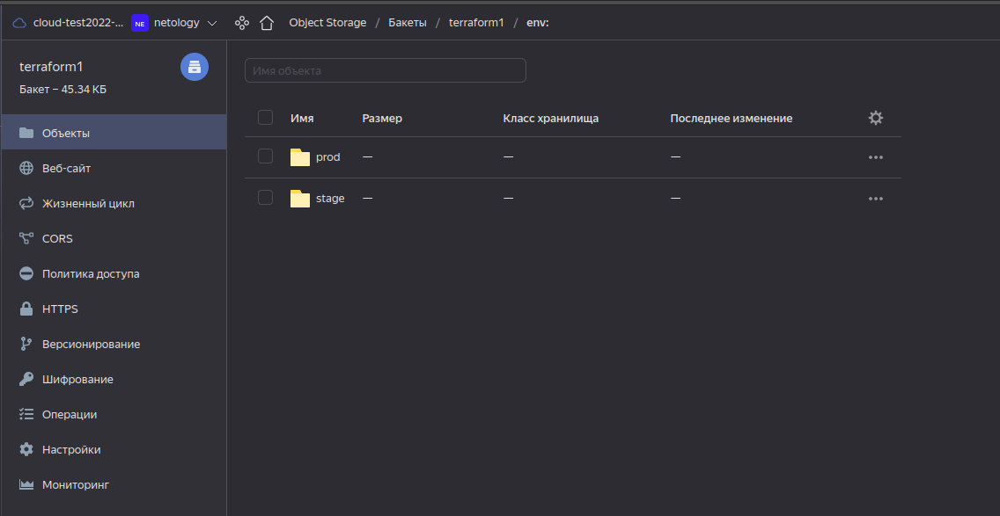
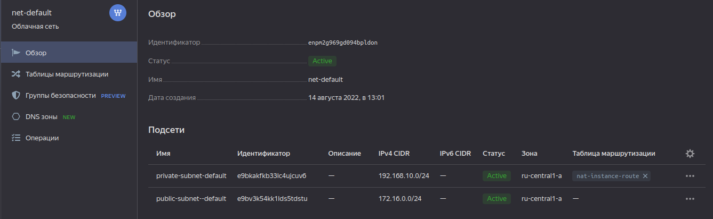
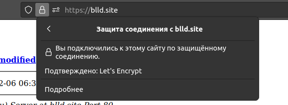
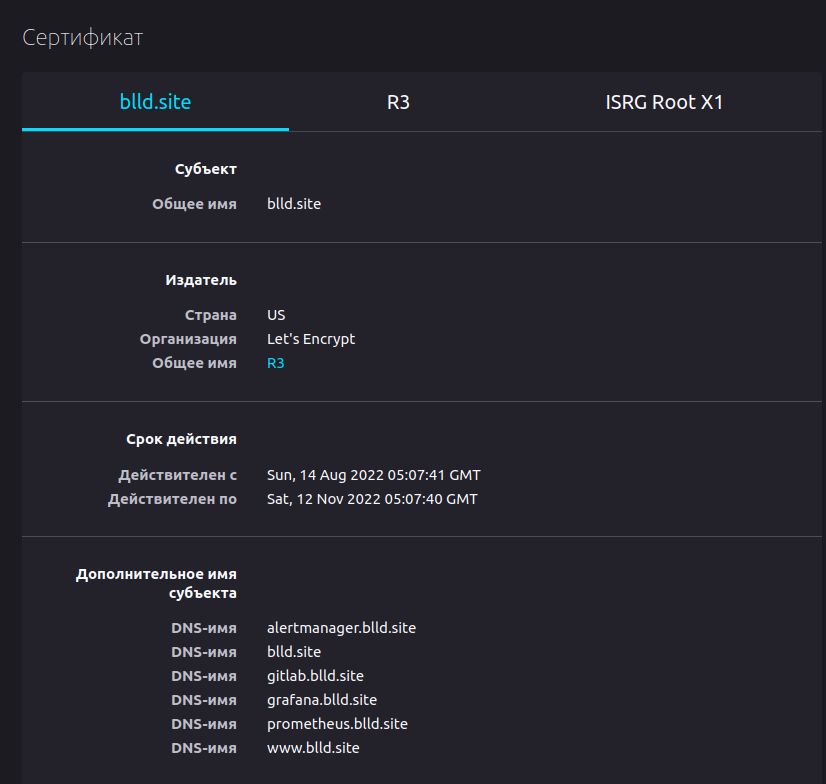

# Дипломное задание по курсу «DevOps-инженер»

Цели:
1. Зарегистрировать доменное имя (любое на ваш выбор в любой доменной зоне).
2. Подготовить инфраструктуру с помощью Terraform на базе облачного провайдера YandexCloud.
3. Настроить внешний Reverse Proxy на основе Nginx и LetsEncrypt.
4. Настроить кластер MySQL.
5. Установить WordPress.
6. Развернуть Gitlab CE и Gitlab Runner.
7. Настроить CI/CD для автоматического развёртывания приложения.
8. Настроить мониторинг инфраструктуры с помощью стека: Prometheus, Alert Manager и Grafana.  

## Описание
1. Зарегестрировано доменное имя blld.site на reg.ru

Управление доменом передано YC, записи dns создаются в terraform

2. Вся инфрастуктура разворачивается с помощью Terraform в течение минут 30+, самый долгий этап gitlab (до 15 минут). 
Необходимые параметры заполняются в variables.tf и inventory.tf в vars.

В качестве backend выбран S3 bucket в YC.

3. Для маршрутизации использовался image с NAT от YC и настроена таблица маршрутизации. Маршрутизация настраивается
в terraform. На него уже устанавливался nginx для Reverse Proxy

Сертификаты  
  

