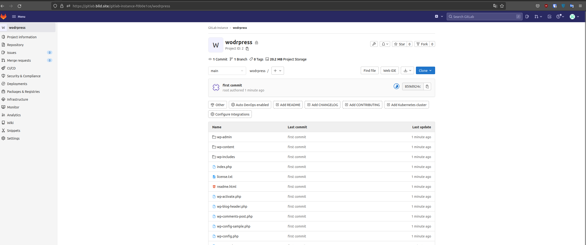
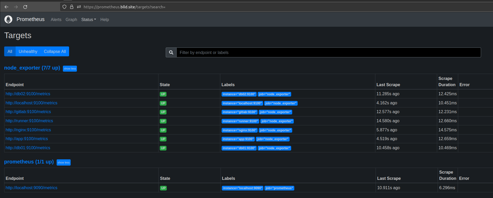

# Дипломное задание по курсу «DevOps-инженер»

Цели:
1. Зарегистрировать доменное имя (любое на ваш выбор в любой доменной зоне).
2. Подготовить инфраструктуру с помощью Terraform на базе облачного провайдера YandexCloud.
3. Настроить внешний Reverse Proxy на основе Nginx и LetsEncrypt.
4. Настроить кластер MySQL.
5. Установить WordPress.
6. Развернуть Gitlab CE и Gitlab Runner.
7. Настроить CI/CD для автоматического развёртывания приложения.
8. Настроить мониторинг инфраструктуры с помощью стека: Prometheus, Alert Manager и Grafana.  

## Описание
1. Зарегестрировано доменное имя blld.site на reg.ru


Управление доменом передано YC, записи dns создаются в terraform  


2. Вся инфрастуктура разворачивается с помощью Terraform в течение минут 30+, самый долгий этап gitlab (до 15 минут). 
Необходимые параметры заполняются в variables.tf и inventory.tf в vars.


В качестве backend выбран S3 bucket в YC.  


3. Для маршрутизации использовался image с NAT от YC и настроена таблица маршрутизации. Маршрутизация настраивается
в terraform. На него уже устанавливался nginx для Reverse Proxy  


Сертификаты    
  


4. mysql работает в master/slave

```sql
mysql> show slave status\G
*************************** 1. row ***************************
               Slave_IO_State: Waiting for source to send event
                  Master_Host: 192.168.10.7
                  Master_User: replica
                  Master_Port: 3306
                Connect_Retry: 60
              Master_Log_File: mysql-bin.000002
          Read_Master_Log_Pos: 2001400
               Relay_Log_File: mysql-relay-bin.000005
                Relay_Log_Pos: 2001616
        Relay_Master_Log_File: mysql-bin.000002
             Slave_IO_Running: Yes
            Slave_SQL_Running: Yes
              Replicate_Do_DB: 
          Replicate_Ignore_DB: 
           Replicate_Do_Table: 
       Replicate_Ignore_Table: 
      Replicate_Wild_Do_Table: 
  Replicate_Wild_Ignore_Table: 
                   Last_Errno: 0
                   Last_Error: 
                 Skip_Counter: 0
          Exec_Master_Log_Pos: 2001400
              Relay_Log_Space: 2001995
              Until_Condition: None
               Until_Log_File: 
                Until_Log_Pos: 0
           Master_SSL_Allowed: No
           Master_SSL_CA_File: 
           Master_SSL_CA_Path: 
              Master_SSL_Cert: 
            Master_SSL_Cipher: 
               Master_SSL_Key: 
        Seconds_Behind_Master: 0
Master_SSL_Verify_Server_Cert: No
                Last_IO_Errno: 0
                Last_IO_Error: 
               Last_SQL_Errno: 0
               Last_SQL_Error: 
  Replicate_Ignore_Server_Ids: 
             Master_Server_Id: 1
                  Master_UUID: 8d54c3b1-1b97-11ed-b196-d00de2b23ec8
             Master_Info_File: mysql.slave_master_info
                    SQL_Delay: 0
          SQL_Remaining_Delay: NULL
      Slave_SQL_Running_State: Replica has read all relay log; waiting for more updates
           Master_Retry_Count: 86400
                  Master_Bind: 
      Last_IO_Error_Timestamp: 
     Last_SQL_Error_Timestamp: 
               Master_SSL_Crl: 
           Master_SSL_Crlpath: 
           Retrieved_Gtid_Set: 
            Executed_Gtid_Set: 
                Auto_Position: 0
         Replicate_Rewrite_DB: 
                 Channel_Name: 
           Master_TLS_Version: 
       Master_public_key_path: 
        Get_master_public_key: 0
            Network_Namespace: 
1 row in set, 1 warning (0.00 sec)
```

5. Стартовая wodrpress


6. gitlab установлен  


7. Создан репозиторий wordpress(WP). С сервера WP данные залиты в репозиторий. Во время настройки pipiline стенд периодически
повисал, пришлось увеличить через YC оперативной памяти до 8 Гб  



Настроен pipeline:

```yml
stages:
  - deploy

deploy-job:
    stage: deploy
    script:
      - ssh -o StrictHostKeyChecking=no ubuntu@app.blld.site sudo chown ubuntu /var/www/test/wordpress/ -R
      - rsync -rvz -e "ssh -o StrictHostKeyChecking=no" ./* ubuntu@app.blld.site.:/var/www/test/wordpress/
      - ssh -o StrictHostKeyChecking=no ubuntu@app.blld.site sudo chown www-data /var/www/test/wordpress/ -R
      - echo "deploy finished"
```
  


Выполнен commit  


8. Работа мониторинга:  




Отключил сервер с wordpress  

Сработал alert  


ошибка в prometheus  


Включил сервер, в grafana период недоступности пустой  

